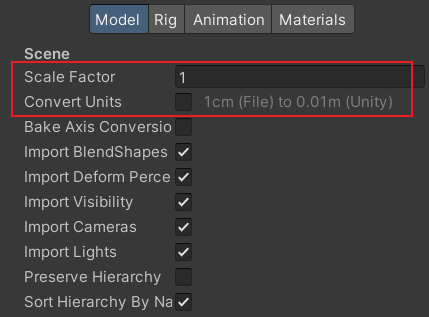
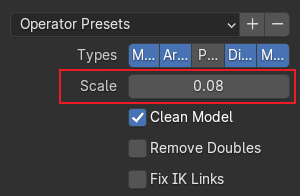
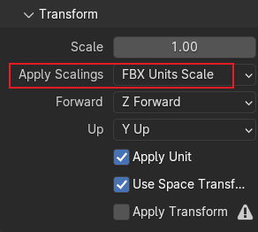
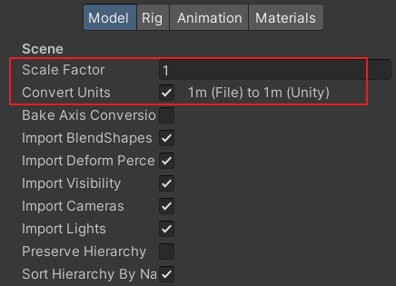
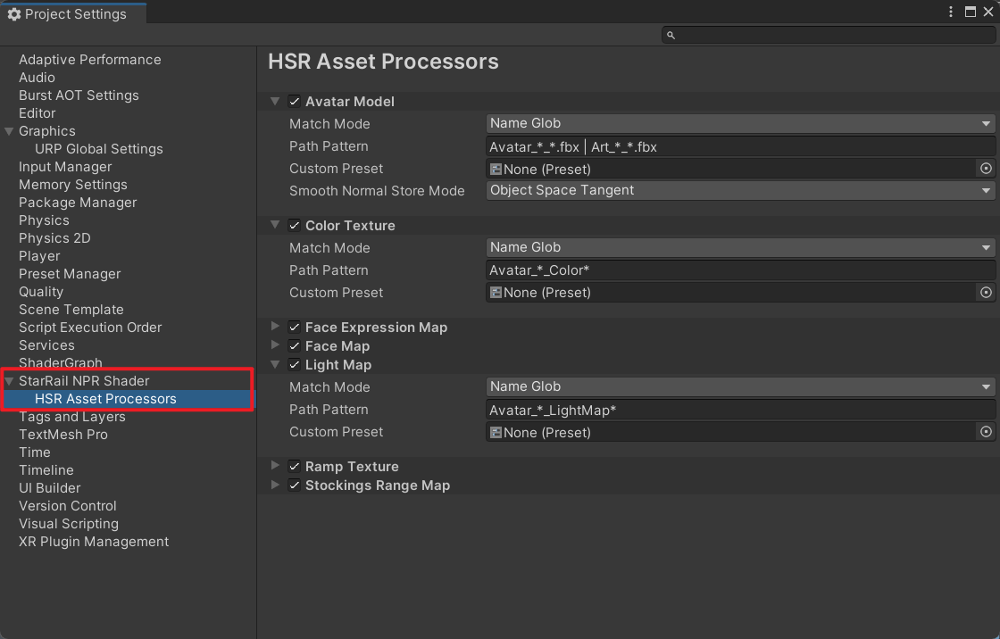

# Asset

## Obtaining Assets

Using this Shader requires a lot of ripped assets, which you need to obtain yourself. This project does not provide assets, tools, or tutorials to help you obtain assets.

## Model Size

Models must be imported at the correct size to ensure proper rendering.

=== "Ripped Models"

    When the model is imported into Unity, set the `Scale Factor` to `1` and uncheck `Convert Units`. (1)
    { .annotate }

    1. Using AssetStudio as an example. It exports models using the FBX SDK. In the [code](https://github.com/Perfare/AssetStudio/blob/d158e864b556b5970709c2a52e47944d53aa98a2/AssetStudioFBXNative/api.cpp#L107-L108){target="_blank"}, the `scaleFactor` is used to set the units, with the default being `1cm`.

        ```cpp
        FbxGlobalSettings& globalSettings = pScene->GetGlobalSettings();
        globalSettings.SetSystemUnit(FbxSystemUnit(scaleFactor));
        ```

        The unit for StarRail character models is `1m`. Therefore, before exporting the model, you need to change the `ScaleFactor` to `100` in the export options. However, some people may not change this value or give an arbitrary value, leading to incorrect FBX units.

        

    

=== "MMD Models"

    The [official MMD models](https://www.aplaybox.com/u/516827875){target="_blank"} are in PMX format, which Unity does not support. You need to use other tools to export the models to FBX. Below is an example using Blender and [blender_mmd_tools](https://github.com/UuuNyaa/blender_mmd_tools/tree/blender-v4){target="_blank"}.

    MMD models use a unit of `0.08m`, while Blender's default unit is `1m`. Therefore, set the `Scale` to `0.08` when importing into Blender.

    

    When exporting to FBX, change `Apply Scalings` to `FBX Units Scale` to apply the scaling to the FBX model units.

    

    After the model is imported into Unity, no further changes are needed.

    

## Processing Assets

Textures and models of characters need to be set up correctly before they can be used. This is a repetitive and tedious task, so this project provides an asset processor. After importing an asset, if its path meets certain requirements, the asset processor will automatically apply presets to it without the need for manual modification of the asset settings. For models, it can also automatically smooth their normals.

Default texture filename formats:

- `Avatar_*_Ramp*`
- `Avatar_*_LightMap*`
- `Avatar_*_Color*`
- `Avatar_*_Stockings*`
- `M_*_*_FaceMap*` or `W_*_*_FaceMap*`
- `M_*_*_Face_ExpressionMap*` or `W_*_*_Face_ExpressionMap*`

Default model filename formats:

- `Avatar_*_*.fbx` or `Art_*_*.fbx`

By default, case is ignored. `*` represents zero or more characters.

??? question "Configure Asset Processor"

    The asset processor can be configured in `Project Settings/StarRail NPR Shader/HSR Asset Processors`.

    

    - `Match Mode`: The matching mode for assets.

        - `Name Glob`: `Path Pattern` uses a syntax similar to Unix Glob, ignoring case, to match the asset's name (including the extension).

            - `*`: Matches zero or more characters.
            - `?`: Matches exactly one character.
            - `|`: Separates multiple Globs. For example, `a.* | b.*` means matching either `a.*` or `b.*`.

        - `Regex`: Treats `Path Pattern` as a regular expression to match the complete asset path.
        - `Equals`: Matches successfully if the complete asset path is equal to `Path Pattern`.
        - `Contains`: Matches successfully if the complete asset path contains `Path Pattern`.
        - `Starts With`: Matches successfully if the complete asset path starts with `Path Pattern`.
        - `Ends With`: Matches successfully if the complete asset path ends with `Path Pattern`.

    - `Path Pattern`: The pattern string.
    - `Ignore Case`: Whether to ignore case during matching.
    - `Custom Preset`: Custom preset. If empty, the default preset is used.
    - `Smooth Normal Store Mode`: The mode for storing smoothed normals in models.
