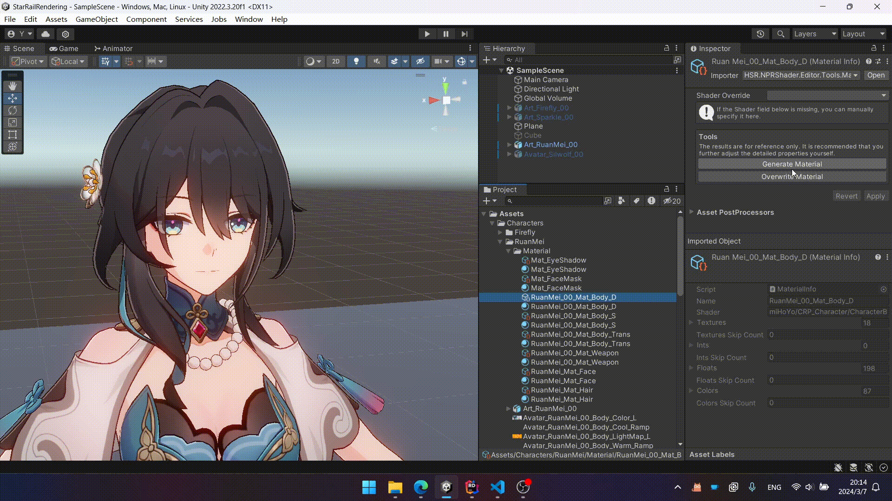

# Material

## Shaders

- Honkai Star Rail/Character/Body
- Honkai Star Rail/Character/Body (Transparent)
- Honkai Star Rail/Character/EyeShadow
- Honkai Star Rail/Character/Face
- Honkai Star Rail/Character/FaceMask
- Honkai Star Rail/Character/Hair

## Tips

- It is recommended to reset the material after changing its shader.
- If using MMD models, set `Model Type` to `MMD` at the top of the material. MMD models lack some detailed information, so the rendering may not be as good as ripped models.
- If the outline flickers or obscures the model, adjust the `Z Offset` value in the material's `Outline` section. Typically, this is a small negative number like `-1e-05` or `-1e-04`.
- If self shadow produces strange patterns (Shadow Acne), adjust the `Depth Bias` and `Normal Bias` in the material's `Self Shadow Caster` section. Typically, this is a negative number of the same order of magnitude as `-0.01`.

## Auto-Generate Materials

!!! info "Prerequisites"

    You need the ability to export in-game materials as JSON files. These files will be referred to as `material.json` from here on.

This project provides a tool for automatically generating or overwriting a Material based on the `material.json` file.


The results generated by this tool are for reference only. Some detailed properties, such as `BackFaceUseUV2`, etc., still need to be manually configured.

Double-clicking on the converted `material.json` file opens the `HSR Material Viewer`, which makes it easier to browse the contents of the `material.json` file.



??? info "Tool Extension"

    After importing the `HSR.NPRShader.Editor.Automation` namespace, declare a class with a parameterless constructor derived from `BaseMaterialSetter`.

    The following members can be overridden:

    |Member Type|Name|Description|
    |:-|:-|:-|
    |Property|`Order`|Priority. The smaller the number, the higher the priority.|
    |Property|`SupportedShaderMap`|Shader map supported by this class. Key is the Shader name in the game, and Value is the converted Shader name in the project.|
    |Method|`ApplyTextures`|The parameters passed in are the Texture information in the `material.json` file, and the methods return a list of Textures to be set on the Material.|
    |Method|`ApplyInts`|The parameters passed in are the Int information in the `material.json` file, and the methods return a list of Ints to be set on the Material.|
    |Method|`ApplyFloats`|The parameters passed in are the Float information in the `material.json` file, and the methods return a list of Floats to be set on the Material.|
    |Method|`ApplyColors`|The parameters passed in are the Color information in the `material.json` file, and the methods return a list of Colors to be set on the Material.|

    ```csharp title="Example"
    public class FaceMaterialSetter : BaseMaterialSetter
    {
        protected override IReadOnlyDictionary<string, string> SupportedShaderMap => new Dictionary<string, string>()
        {
            ["miHoYo/CRP_Character/CharacterFace"] = "Honkai Star Rail/Character/Face"
        };

        protected override IEnumerable<(string, TextureJsonData)> ApplyTextures(IReadOnlyDictionary<string, TextureJsonData> textures)
        {
            yield return ("_MainTex", textures["_MainTex"]);
            yield return ("_FaceMap", textures["_FaceMap"]);
            yield return ("_ExpressionMap", textures["_FaceExpression"]);
        }

        protected override IEnumerable<(string, float)> ApplyFloats(IReadOnlyDictionary<string, float> floats)
        {
            if (floats.TryGetValue("_UseUVChannel2", out float useUV2))
            {
                yield return ("_FaceMapUV2", useUV2);
            }

            yield return ("_EmissionThreshold", floats["_EmissionThreshold"]);
            yield return ("_EmissionIntensity", floats["_EmissionIntensity"]);

            yield return ("_NoseLinePower", floats["_NoseLinePower"]);

            yield return ("_mmBloomIntensity0", floats["_mBloomIntensity0"]);
        }

        protected override IEnumerable<(string, Color)> ApplyColors(IReadOnlyDictionary<string, Color> colors)
        {
            yield return ("_Color", colors["_Color"]);
            yield return ("_ShadowColor", colors["_ShadowColor"]);
            yield return ("_EyeShadowColor", colors["_EyeShadowColor"]);
            yield return ("_EmissionColor", Color.white);
            yield return ("_OutlineColor0", colors["_OutlineColor"]);
            yield return ("_NoseLineColor", colors["_NoseLineColor"]);

            // Texture Scale Offset
            yield return ("_Maps_ST", colors["_MainMaps_ST"]);

            // Expression
            yield return ("_ExCheekColor", colors["_ExCheekColor"]);
            yield return ("_ExShyColor", colors["_ExShyColor"]);
            yield return ("_ExShadowColor", colors["_ExShadowColor"]);
            yield return ("_ExEyeColor", colors["_ExEyeColor"]);
        }
    }
    ```
