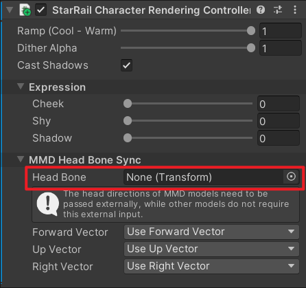

# MMD Model

!!! warning

    MMD models do not contain some detailed information so the final rendering result may not fully meet your expectation.

## Use MMD Mode

Change the `Model Type` to `MMD` on the material.

## Synchronize Head Bone

Drag the `Transform` of the head bone to the `Head Bone` field.

