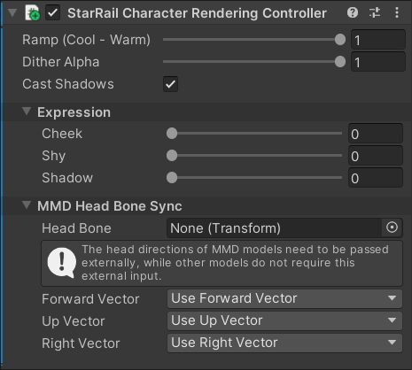

# Rendering Controller

The `StarRail Character Rendering Controller` component is automatically added to the root object of the character.

This component makes it easy to control some rendering parameters.

## C# API

### Properties

|Name|Description|
|:-|:-|
|`RampCoolWarmMix`|Blend level of the cool and warm Ramp textures. 0 is cool, 1 is warm. Range $[0, 1]$.|
|`DitherAlpha`|Transparency of the character. Range $[0, 1]$.|
|`ExpressionCheekIntensity`|Degree of cheek blush. Range $[0, 1]$.|
|`ExpressionShyIntensity`|Shyness level. Range $[0, 1]$.|
|`ExpressionShadowIntensity`|Darkening of the face. Range $[0, 1]$.|
|`IsCastingShadow`|Whether to cast shadows.|

### Methods

|Name|Description|
|:-|:-|
|`UpdateRendererList`|Update the internal cached list of `Renderer` in the controller.|

## SRP Batcher

This component uses [`MaterialPropertyBlock`](https://docs.unity3d.com/ScriptReference/MaterialPropertyBlock.html) and does not support [SRP Batcher](https://docs.unity3d.com/Manual/SRPBatcher.html) in Editor. However, [`Renderer.material`](https://docs.unity3d.com/ScriptReference/Renderer-material.html) will be used after Build to support SRP Batcher.
