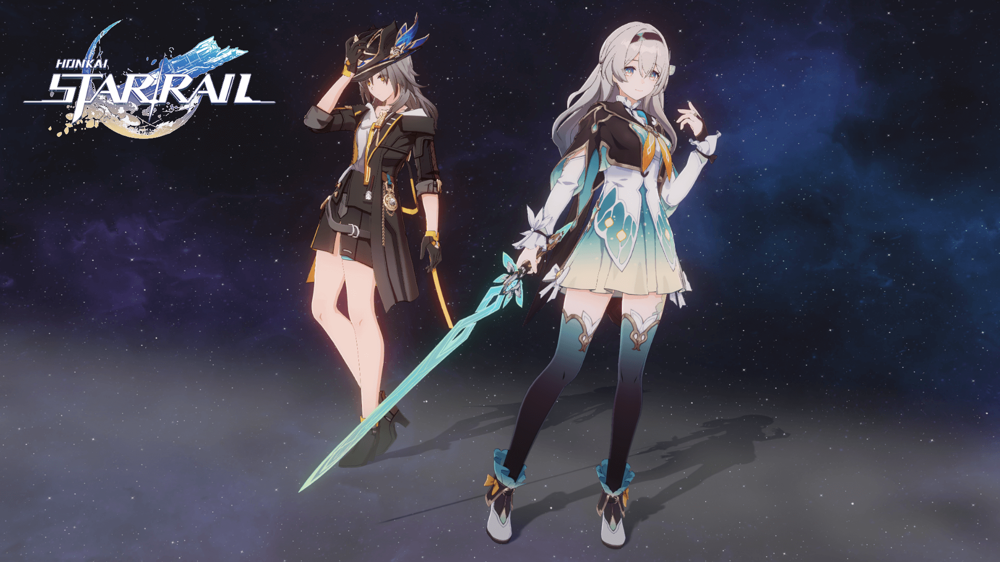

# StarRail NPR Shader Docs

{.fancybox-thumbnail}

Fan-made shaders for Unity URP attempting to replicate the shading of Honkai: Star Rail. {.sr-sticker}

## Core Features

- Supports both ripped model and MMD model.
- Supports Forward and Forward+ rendering paths.
- Supports transparent front hair.
- Supports self shadow and per-object shadow, up to 16 on the same screen.
- Custom Bloom and Tonemapping.
- Custom material editor.
- Automated workflow (smoothing normals, setting up textures, generating materials, building), integrated with Unity Preset system.
- Verified on Windows and Android.

## Sponsor

If you like this project, you can sponsor Firefly {.sr-sticker} with an Oak Cake Rolls, chirp! Link: [https://stalomeow.com/#coffee](https://stalomeow.com/#coffee){target="_blank"}.

## Special Thanks

- [miHoYo](https://mihoyo.com/){target="_blank"} / [HoYoverse](https://hoyoverse.com/){target="_blank"}
- [Razmoth](https://github.com/Razmoth){target="_blank"}
- [m4urlcl0](https://github.com/m4urlclo0){target="_blank"}
- °Nya°222
