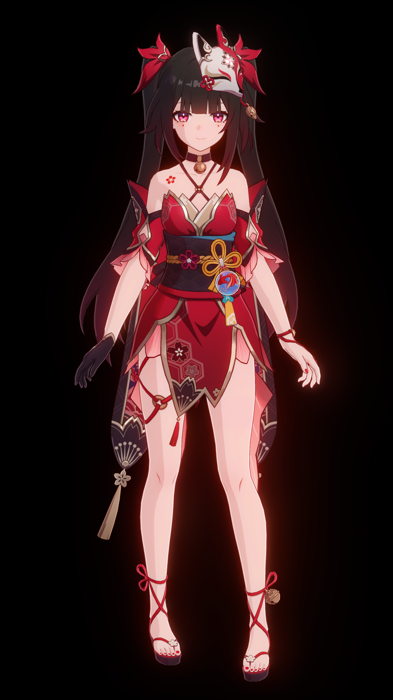
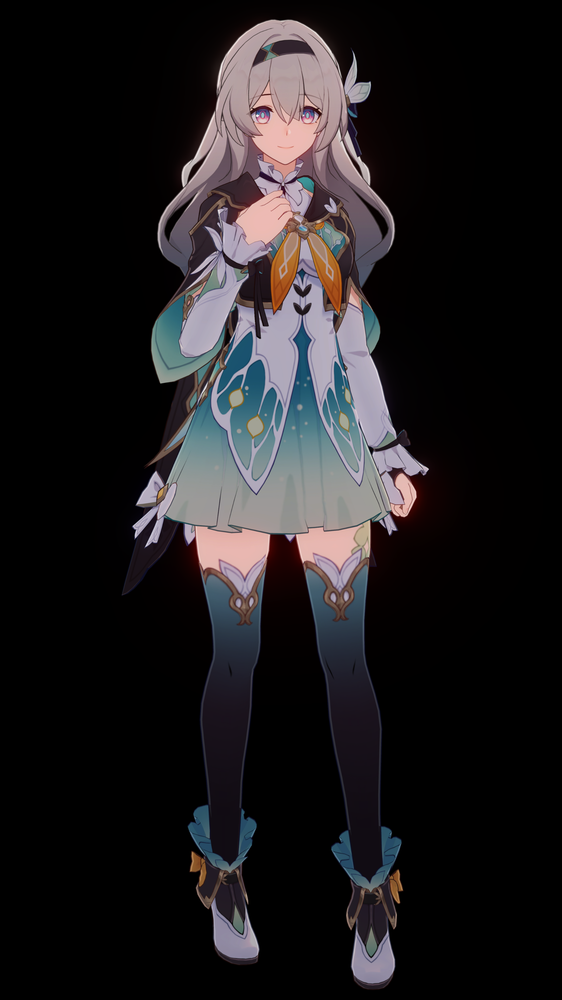

# StarRail NPR Shader Docs

!!! abstract ""

    

    May this journey 
    lead us starward
    

Fan-made shaders for Unity URP attempting to replicate the shading of Honkai: Star Rail. The shaders are not 100% accurate because this project is not a reverse engineering - what I do is to replicate the in-game looks to the best of my ability.

|Sparkle|Firefly|
|:-:|:-:|
|||

## Features

### Character Shaders

- Honkai Star Rail/Character/Body
- Honkai Star Rail/Character/Body (Transparent)
- Honkai Star Rail/Character/EyeShadow
- Honkai Star Rail/Character/Face
- Honkai Star Rail/Character/FaceMask
- Honkai Star Rail/Character/Hair

### Rendering

- Both Game model and MMD model.
- Support `Forward` and `Forward+` rendering paths.
- A single `RendererFeature` to manage all custom passes.
- Provide C# API to control some rendering behavior.
- Characters receive only scene shadows and ignore self-shadows.
- Per-object shadow, supporting up to 16 shadows on the same screen.
- Custom bloom using the method shared by Jack He in Unite 2018.
- Custom Tonemapping.

### Editor

- Customized material editor.
- Configurable asset processor integrated with Unity preset system.
- Automatically smooth normal.
- Automatic material setup.
- Build processor and Shader stripper.
- `material.json` inspector.

## Special Thanks

- miHoYo / HoYoverse
- Razmoth
- °Nya°222
