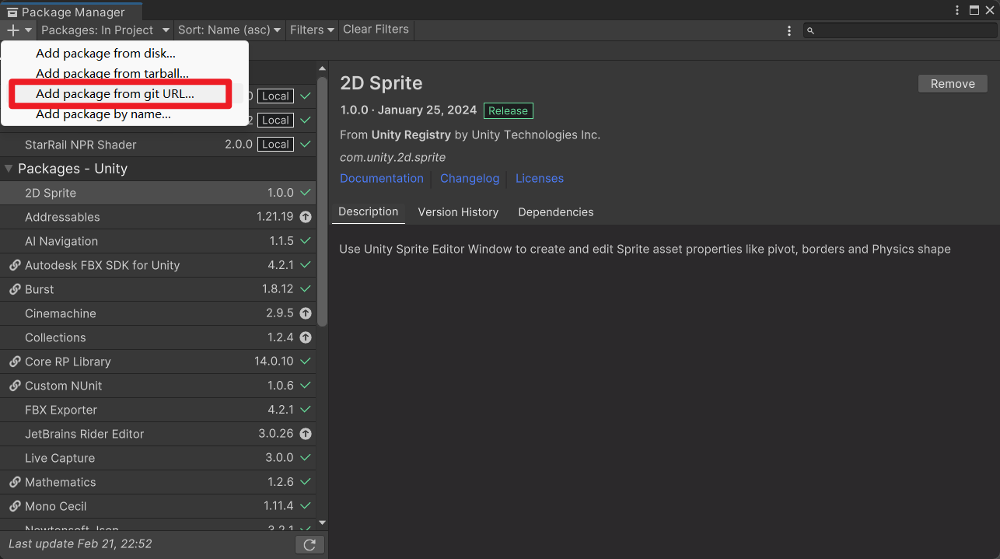
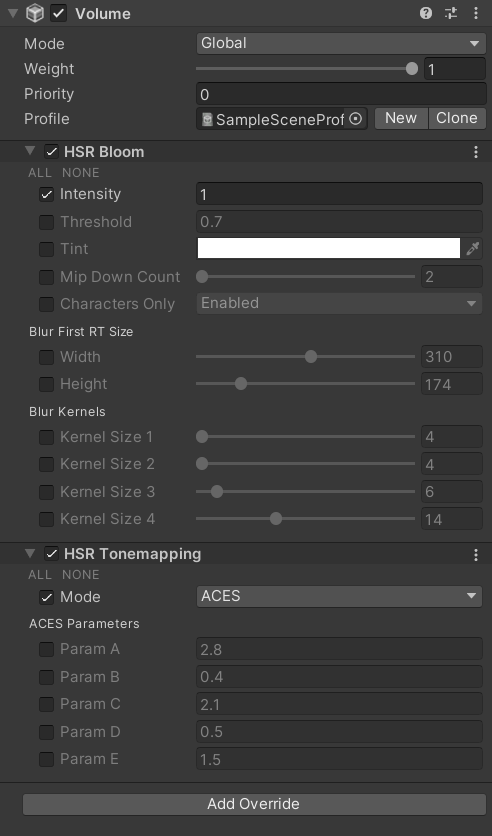

# Installation

## Requirements

- Unity >= 2022.3.20
- Core RP Library >= 14.0.10
- Universal RP >= 14.0.10

Since the API frequently changes, it is recommended not to use a version that is too high.

## Install via git URL

1. Select `Add package from git URL...` from the add menu of Package Manager.

    

2. Enter the following in the text box:

    ```txt
    https://github.com/stalomeow/StarRailNPRShader.git
    ```

3. Select `Add`.

## Render Pipeline Settings

- Add `Honkai Star Rail` RendererFeature to the Renderer. It has built-in screen space shadows, so remove the `ScreenSpaceShadows` RendererFeature of URP.
- Use Linear color space.
- Use Forward or Forward+ rendering path.
- Disable Depth priming.
- It is recommended to enable HDR.

## Post-processing Settings

Post-processing is important; be sure to add it.


