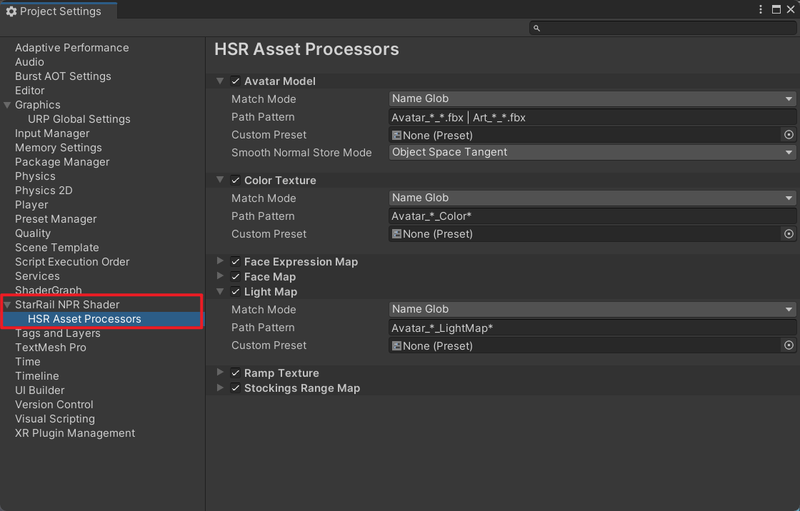

# 资产和材质

## 处理资产

角色的贴图和模型需要被正确地设置后才能使用。这个工作重复且繁琐，所以该项目提供了资产处理器。在导入资产后，如果它的路径满足一定要求，资产处理器会自动将预设应用到该资产上，不需要再手动设置。对于模型，还能自动平滑它的法线。

默认的贴图文件名格式：

- `Avatar_*_Ramp*`
- `Avatar_*_LightMap*`
- `Avatar_*_Color*`
- `Avatar_*_Stockings*`
- `M_*_*_FaceMap*` 或 `W_*_*_FaceMap*`
- `M_*_*_Face_ExpressionMap*` 或 `W_*_*_Face_ExpressionMap*`

默认的模型文件名格式：

- `Avatar_*_*.fbx` 或 `Art_*_*.fbx`

默认不区分大小写。`*` 表示 0 个或多个字符。

??? question "配置资产处理器"

    可以在 `Project Settings/StarRail NPR Shader/HSR Asset Processors` 中配置资产处理器。

    

    - `Match Mode`：资产的匹配方式。

        - `Name Glob`：`Path Pattern` 使用类似 Unix Glob 的语法，忽略大小写，匹配资产的名称（包含扩展名）。

            - `*`：匹配 0 个或多个字符。
            - `?`：匹配 1 个字符。
            - `|`：分割多个 Glob。例如，`a.* | b.*` 表示匹配 `a.*` 或 `b.*` 中任意一个。

        - `Regex`：将 `Path Pattern` 作为正则表达式，匹配资产完整路径。
        - `Equals`：资产完整路径与 `Path Pattern` 相等，则匹配成功。
        - `Contains`：资产完整路径包含 `Path Pattern`，则匹配成功。
        - `Starts With`：资产完整路径以 `Path Pattern` 开头，则匹配成功。
        - `Ends With`：资产完整路径以 `Path Pattern` 结尾，则匹配成功。

    - `Path Pattern`：模式字符串。
    - `Ignore Case`：匹配时是否忽略大小写。
    - `Custom Preset`：自定义预设。如果为空则使用默认的预设。
    - `Smooth Normal Store Mode`：模型平滑法线的保存方式。

## 着色器

- Honkai Star Rail/Character/Body
- Honkai Star Rail/Character/Body (Transparent)
- Honkai Star Rail/Character/EyeShadow
- Honkai Star Rail/Character/Face
- Honkai Star Rail/Character/FaceMask
- Honkai Star Rail/Character/Hair

## 材质

- 更换着色器以后记得先重置一下。
- 没有描边/边缘光的话，在材质编辑器上面调整一下 `Model Scale`。
