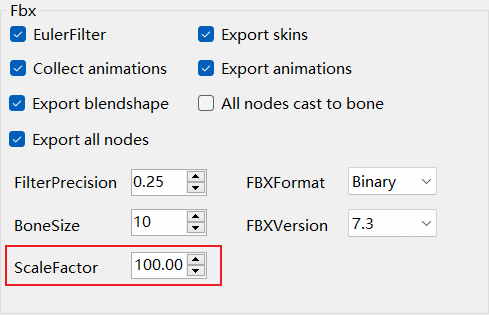
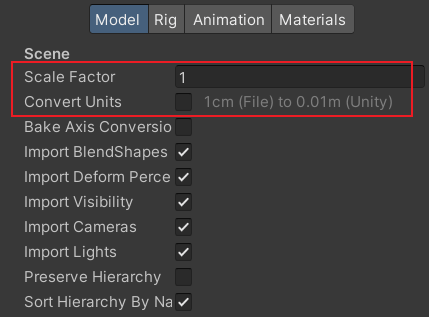
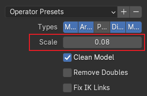
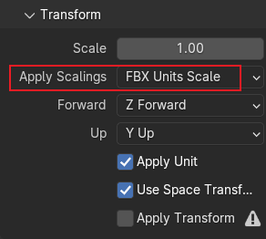
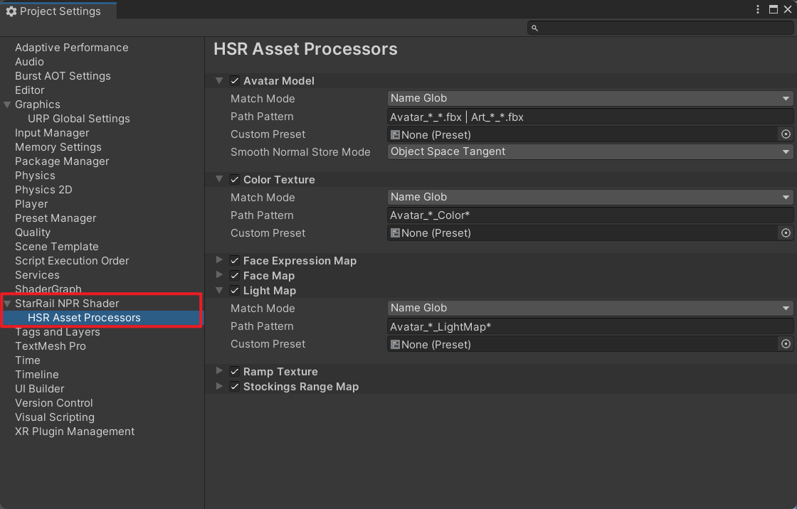

# 资产

## 获取资产

使用这套 Shader 需要较多解包资产，请自行获取。本项目不提供资产，也不提供工具和教程帮助你获取资产。

## 模型大小

模型必须导入成正确的大小，否则渲染会出错。

=== "解包模型"

    当模型被导入 Unity 后，将 `Scale Factor` 设置为 `1` 并取消勾选 `Convert Units`。(1)
    { .annotate }

    1. 以 AssetStudio 为例。它使用 FBX SDK 导出模型，[代码](https://github.com/Perfare/AssetStudio/blob/d158e864b556b5970709c2a52e47944d53aa98a2/AssetStudioFBXNative/api.cpp#L107-L108){target="_blank"}中用 `scaleFactor` 设置单位，默认是 `1cm`。

        ``` cpp
        FbxGlobalSettings& globalSettings = pScene->GetGlobalSettings();
        globalSettings.SetSystemUnit(FbxSystemUnit(scaleFactor));
        ```

        星穹铁道角色模型的单位是 `1m`，所以，在导出模型前，需要在 Export options 中把 `ScaleFactor` 改成 `100`。但是，有些人没改这个值，或者随便给了一个值，导致 FBX 单位不对。

        

    

=== "MMD 模型"

    [官方 MMD 模型](https://www.aplaybox.com/u/516827875){target="_blank"}是 PMX 格式，Unity 不支持，需要使用其他工具将模型导出为 FBX。下面以 Blender 和 [blender_mmd_tools](https://github.com/UuuNyaa/blender_mmd_tools/tree/blender-v4){target="_blank"} 为例。

    MMD 模型的单位是 `0.08m`，Blender 的默认单位是 `1m`，所以，在导入 Blender 时，将 `Scale` 设置为 `0.08`。

    

    在导出为 FBX 时，将 `Apply Scalings` 改成 `FBX Units Scale`，把缩放应用到 FBX 模型的单位上。

    

    当模型被导入 Unity 后，什么都不用改。

    

## 处理资产

角色的贴图和模型需要被正确地设置后才能使用。这个工作重复且繁琐，所以该项目提供了资产处理器。在导入资产后，如果它的路径满足一定要求，资产处理器会自动将预设应用到该资产上，不需要再手动设置。对于模型，还能自动平滑它的法线。

默认的贴图文件名格式：

- `Avatar_*_Ramp*`
- `Avatar_*_LightMap*`
- `Avatar_*_Color*`
- `Avatar_*_Stockings*`
- `M_*_*_FaceMap*` 或 `W_*_*_FaceMap*`
- `M_*_*_Face_ExpressionMap*` 或 `W_*_*_Face_ExpressionMap*`

默认的模型文件名格式：

- `Avatar_*_*.fbx` 或 `Art_*_*.fbx`

默认不区分大小写。`*` 表示 0 个或多个字符。

??? info "配置资产处理器"

    可以在 `Project Settings/StarRail NPR Shader/HSR Asset Processors` 中配置资产处理器。

    

    - `Match Mode`：资产的匹配方式。

        - `Name Glob`：`Path Pattern` 使用类似 Unix Glob 的语法，忽略大小写，匹配资产的名称（包含扩展名）。

            - `*`：匹配 0 个或多个字符。
            - `?`：匹配 1 个字符。
            - `|`：分割多个 Glob。例如，`a.* | b.*` 表示匹配 `a.*` 或 `b.*` 中任意一个。

        - `Regex`：将 `Path Pattern` 作为正则表达式，匹配资产完整路径。
        - `Equals`：资产完整路径与 `Path Pattern` 相等，则匹配成功。
        - `Contains`：资产完整路径包含 `Path Pattern`，则匹配成功。
        - `Starts With`：资产完整路径以 `Path Pattern` 开头，则匹配成功。
        - `Ends With`：资产完整路径以 `Path Pattern` 结尾，则匹配成功。

    - `Path Pattern`：模式字符串。
    - `Ignore Case`：匹配时是否忽略大小写。
    - `Custom Preset`：自定义预设。如果为空则使用默认的预设。
    - `Smooth Normal Store Mode`：模型平滑法线的保存方式。
