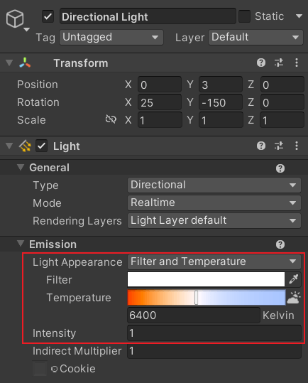
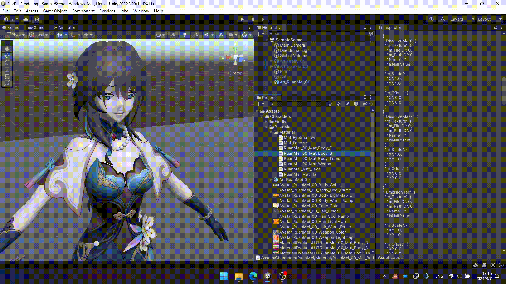
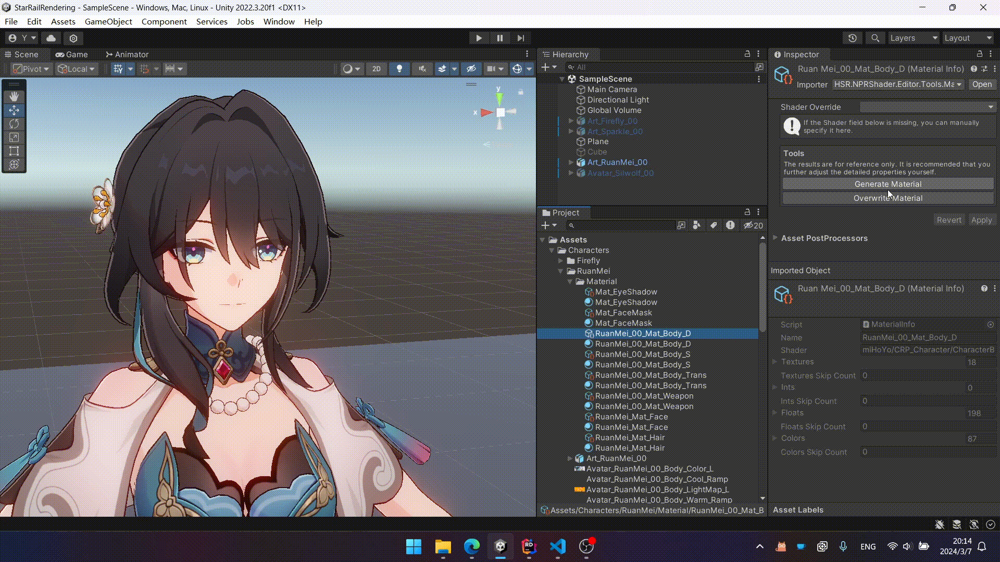

# 材质

## 着色器

- Honkai Star Rail/Character/Body
- Honkai Star Rail/Character/Body (Transparent)
- Honkai Star Rail/Character/EyeShadow
- Honkai Star Rail/Character/Face
- Honkai Star Rail/Character/FaceMask
- Honkai Star Rail/Character/Hair

## 提示

- 更换着色器以后建议重置一下材质。
- 主光源的颜色和强度会影响角色，需要调整为合适的值。可以参考下图的设置。

    

- 如果使用 MMD 模型，在材质最上面把 `Model Type` 改成 `MMD`。MMD 模型缺少一些细节信息，所以渲染出来不如解包模型好看。
- 如果出现描边闪烁、遮挡模型的情况，在材质 `Outline` 中调整 `Z Offset` 的值。一般是 `-1e-05` 或者 `-1e-04` 这样很小的负值。
- 如果自阴影出现奇怪的花纹（Shadow Acne），在材质 `Self Shadow Caster` 中调整 `Depth Bias` 和 `Normal Bias`。一般是和 `-0.01` 同数量级的负值。

## 自动生成材质

!!! info "前提"

    你需要具备将游戏内材质导出为 JSON 文件的能力。下面将这类文件简称为 `material.json`。

该项目提供了工具，可以根据 `material.json` 自动生成材质或者覆写一个已经存在的材质。



这个工具生成的结果仅供参考。一些细节的参数，比如 `BackFaceUseUV2` 等，仍然需要自己手动设置。

双击转换后的 `material.json` 文件，可以打开 `HSR Material Viewer`。它能帮你更轻松地浏览 `material.json` 文件。



??? info "工具扩展"

    引入 `HSR.NPRShader.Editor.Automation` 命名空间后，声明一个具有无参构造方法的类，派生自 `BaseMaterialSetter`。

    可重写的成员如下：

    |成员类型|名称|描述|
    |:-|:-|:-|
    |Property|`Order`|优先级。数字越小优先级越高。|
    |Property|`SupportedShaderMap`|该类支持的 Shader 表。Key 是游戏里的 Shader 名，Value 是转换后的项目中的 Shader 名。|
    |Method|`ApplyTextures`|传入的参数为 `material.json` 中的 Texture 信息，返回需要设置到 Material 上的 Texture 列表。|
    |Method|`ApplyInts`|传入的参数为 `material.json` 中的 Int 信息，返回需要设置到 Material 上的 Int 列表。|
    |Method|`ApplyFloats`|传入的参数为 `material.json` 中的 Float 信息，返回需要设置到 Material 上的 Float 列表。|
    |Method|`ApplyColors`|传入的参数为 `material.json` 中的 Color 信息，返回需要设置到 Material 上的 Color 列表。|

    ``` csharp title="示例"
    public class FaceMaterialSetter : BaseMaterialSetter
    {
        protected override IReadOnlyDictionary<string, string> SupportedShaderMap => new Dictionary<string, string>()
        {
            ["miHoYo/CRP_Character/CharacterFace"] = "Honkai Star Rail/Character/Face"
        };

        protected override IEnumerable<(string, TextureJsonData)> ApplyTextures(IReadOnlyDictionary<string, TextureJsonData> textures)
        {
            yield return ("_MainTex", textures["_MainTex"]);
            yield return ("_FaceMap", textures["_FaceMap"]);
            yield return ("_ExpressionMap", textures["_FaceExpression"]);
        }

        protected override IEnumerable<(string, float)> ApplyFloats(IReadOnlyDictionary<string, float> floats)
        {
            if (floats.TryGetValue("_UseUVChannel2", out float useUV2))
            {
                yield return ("_FaceMapUV2", useUV2);
            }

            yield return ("_EmissionThreshold", floats["_EmissionThreshold"]);
            yield return ("_EmissionIntensity", floats["_EmissionIntensity"]);

            yield return ("_NoseLinePower", floats["_NoseLinePower"]);

            yield return ("_mmBloomIntensity0", floats["_mBloomIntensity0"]);
        }

        protected override IEnumerable<(string, Color)> ApplyColors(IReadOnlyDictionary<string, Color> colors)
        {
            yield return ("_Color", colors["_Color"]);
            yield return ("_ShadowColor", colors["_ShadowColor"]);
            yield return ("_EyeShadowColor", colors["_EyeShadowColor"]);
            yield return ("_EmissionColor", Color.white);
            yield return ("_OutlineColor0", colors["_OutlineColor"]);
            yield return ("_NoseLineColor", colors["_NoseLineColor"]);

            // Texture Scale Offset
            yield return ("_Maps_ST", colors["_MainMaps_ST"]);

            // Expression
            yield return ("_ExCheekColor", colors["_ExCheekColor"]);
            yield return ("_ExShyColor", colors["_ExShyColor"]);
            yield return ("_ExShadowColor", colors["_ExShadowColor"]);
            yield return ("_ExEyeColor", colors["_ExEyeColor"]);
        }
    }
    ```
