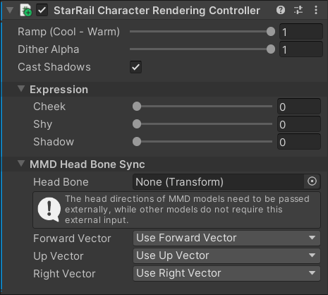

# 渲染控制器

角色的根物体上会自动添加 `StarRail Character Rendering Controller` 组件。

利用该组件可以很方便地控制一些渲染参数。

## C# API

### Properties

|名称|描述|
|:-|:-|
|`RampCoolWarmMix`|冷暖 Ramp 图的混合程度。0 是冷，1 是暖。范围 `[0, 1]`。|
|`DitherAlpha`|角色的透明度。范围 `[0, 1]`。|
|`ExpressionCheekIntensity`|脸颊泛红程度。范围 `[0, 1]`。|
|`ExpressionShyIntensity`|害羞程度。范围 `[0, 1]`。|
|`ExpressionShadowIntensity`|黑脸程度。范围 `[0, 1]`。|
|`IsCastingShadow`|是否投射阴影。|

### Methods

|名称|描述|
|:-|:-|
|`UpdateRendererList`|更新控制器内部缓存的 `Renderer` 列表。|

## SRP Batcher

该组件在 Editor 下使用 [`MaterialPropertyBlock`](https://docs.unity3d.com/ScriptReference/MaterialPropertyBlock.html)，不支持 [SRP Batcher](https://docs.unity3d.com/Manual/SRPBatcher.html)。但在 Build 以后会改用 [`Renderer.material`](https://docs.unity3d.com/ScriptReference/Renderer-material.html)，支持 SRP Batcher。
