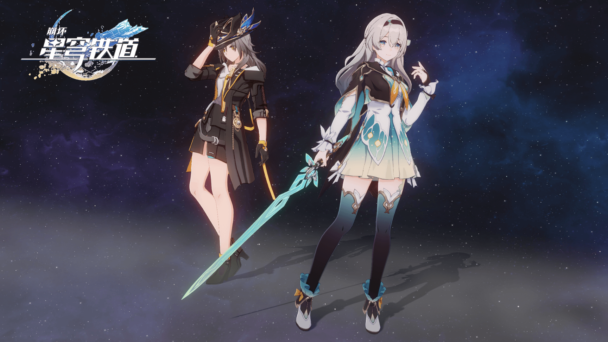

# StarRail NPR Shader 文档

{.fancybox-thumbnail}

基于 Unity URP 的仿星穹铁道渲染 Shader。{.sr-sticker}

## 核心特点

- 支持解包模型和 MMD 模型。
- 支持 Forward 和 Forward+ 渲染路径。
- 支持半透明刘海。
- 支持自阴影和逐物体阴影，同屏最多 16 个。
- 定制的 Bloom 和 Tonemapping。
- 定制的材质编辑器。
- 自动化流程（平滑模型法线、设置贴图、生成材质、构建），集成 Unity Preset 系统。
- 在 Windows 和 Android 上经过验证。

## 赞助

如果你喜欢这个项目，可以赞助流萤 {.sr-sticker} 一份橡木蛋糕卷啾！链接：[https://stalomeow.com/#coffee](https://stalomeow.com/#coffee){target="_blank"}。

## 特别感谢

- [miHoYo](https://mihoyo.com/){target="_blank"} / [HoYoverse](https://hoyoverse.com/){target="_blank"}
- [Razmoth](https://github.com/Razmoth){target="_blank"}
- [m4urlcl0](https://github.com/m4urlclo0){target="_blank"}
- °Nya°222
