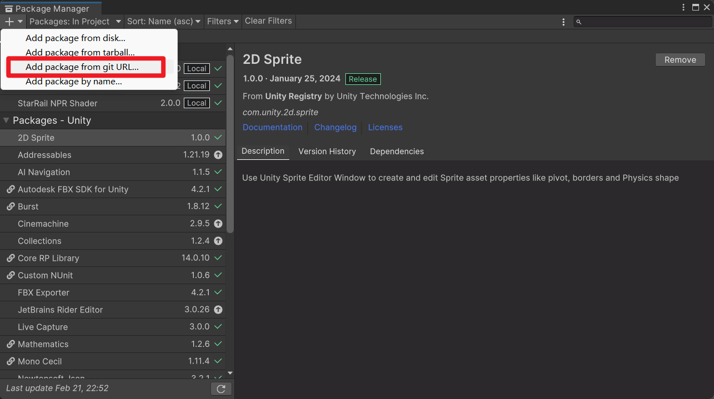

# 安装

## 要求

- Unity >= 2022.3.20
- Core RP Library >= 14.0.10
- Universal RP >= 14.0.10

由于一些 API 经常发生变化，建议别用太高的版本。

## 从 git URL 安装

1. 在 Package Manager 的添加菜单中选择 `Add package from git URL...`。

    

2. 在文本框中输入：

    ``` txt
    https://github.com/stalomeow/StarRailNPRShader.git
    ```

3. 选择 `Add`。

## 渲染管线设置

- 在 Renderer 上添加 `Honkai Star Rail` RendererFeature。它内置了屏幕空间阴影，所以接下来要把 URP 的 `ScreenSpaceShadows` RendererFeature 都移除掉。
- 使用 Linear color space。
- 使用 Forward 或 Forward+ 渲染路径。
- 关闭 Depth priming。
- 推荐打开 HDR。

## 后处理设置

后处理很重要，请务必加上它。


